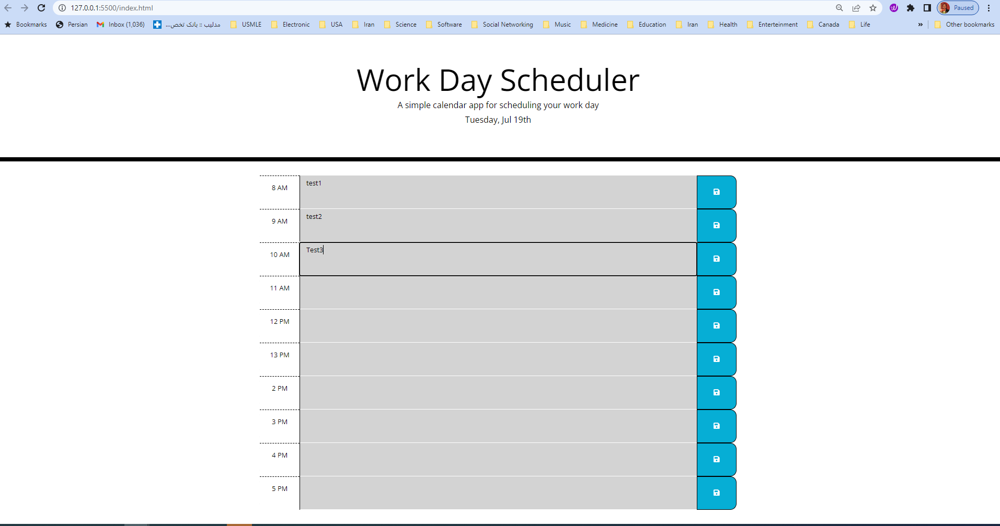

# Work-Day-Scheduler

## Work Day Scheduler

Simple calendar application that allows a user to save events for each hour of the day.

This app will run in the browser and feature dynamically updated HTML and CSS powered by jQuery.

## Contributions

Made by John Aslani

## Screenshot

## Link to deployed application

https://johnaslani.github.io/Work-Day-Scheduler/
